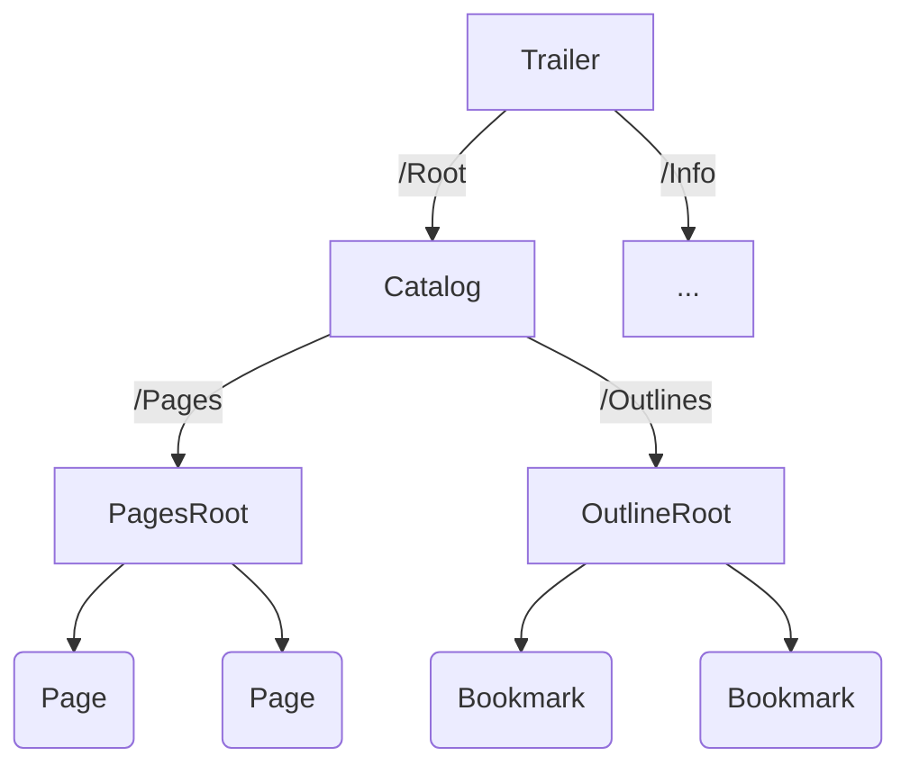
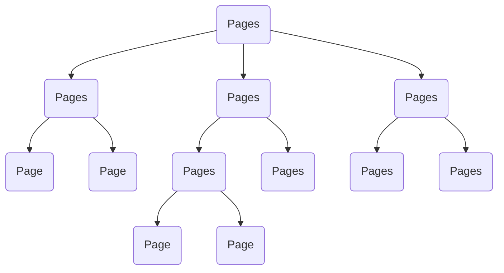

# PDF文件逻辑结构

## PDF属性结构

解析流程：



### Catalog根节点

Catalog是整个PDF逻辑结构的根节点，通过trailer的Root字段定位。

Catalog字典：

```text
3 0 obj             % /Root 3 0 R 根据这个引用找到Catalog字典
<<
    /Type /Catalog  % 注意大小写
    /Pages 1 0 R    % 指向树的根节点
>>
endobj              % 对象结束
```

### Page Tree 根节点

```txt
1 0 obj
<<
    /Type /Pages
    /Kids [2 0 R]   % Page Tree的子节点，可以是Page字典也可以是其它Page Tree节点
    /Count 1        % 文档页数
>>
endobj
```

### Page 字典

```txt
2 0 obj
<<
    /Type /Page
    /Parent 1 0 R
    /MediaBox [0 0 600 800]             % 页面大小为 600 * 800 points
    /Contents 4 0 R                     % 内容流
    /Resources                          % 资源字典
        <<
            /Font << /Font1 5 0 R>>     % 字体列表
        >>
>>
endobj
```

### Contents 字典

```txt
4 0 obj         % 页面内容数据流
<<
    /Length 0   % 数据流的字节数
>>
stream
    BT
        /Font1 10 Tf      % 字体设为Font1，大小为 10 points
        100 70 TD         % 文字坐标
        (hello World!) Tj % 输出文本（不包括括号）
    ET
endstream
endobj
```

### Resources字典

Font字典为例

```txt
5 0 obj
<<
    /Type /Font
    /Subtype /Type1
    /BaseFont /Helvetica
>>
endobj
```

### 页面继承



### 名称字典

TODO: 参考文档(PDF1.2以上版本)