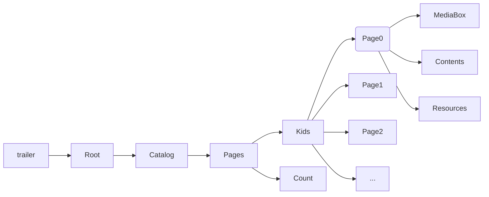

# 了解PDF

## 文档结构

PDF文档由 Header,Body,Cross-reference table, Trailer 四个部分组成。

## 解析流程

1. 从 trailer 中找到 Root 关键字，Root 指向 Catalog 字典;
1. 从 Catalog 中找到 Pages 关键字， Pages 是 PDF所有页面的总入口， 即 Page Tree Root;
1. 从 Pages 中找到 Kids 和 Count 关键字， Kids 中包含 Page 子节点， Count 为该文档的总页数；
1. 从 Page 字典中可以获取到 MediaBox、 Contents、 Resource 等信息，MediaBox 包含页面的宽高信息， Contents 包含 页面内容， Resource 包含页面所需要的资源；
1. 从 Contents 指向的内容流中获取页面内容



## 手写PDF

hello world.pdf

```pdf
%PDF-1.4
1 0 obj <<
    /Type /Pages
    /Kids [2 0 R]
    /Count 1
>> endobj

2 0 obj <<
    /Type /Page
    /Parent 1 0 R
    /MediaBox [0 0  600 800]
    /Contents 4 0 R
    /Resources 5 0 R
>> endobj

3 0 obj <<
    /Type /Catalog
    /Pages 1 0 R
>> endobj

4 0 obj <<
    /Length 0
>> stream
    BT
        /Font1 10 Tf
        100 700 TD
        (hello world!) Tj
    ET
endstream
endobj

5 0 obj <<
    /Type /Font
    /Subtype /Type1
    /BaseFont /Helvetica
>> endobj

xref

trailer <<
    /Size 0
    /Root 3 0 R
>>

startxref 0
%%EOF
```